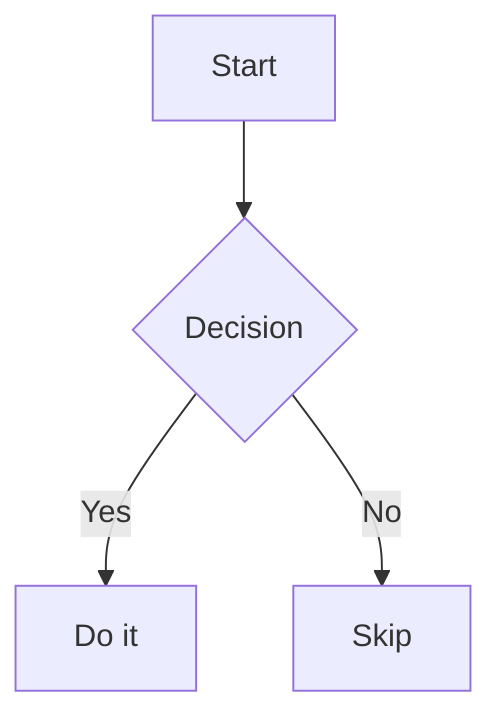

# LLMRender [](https://www.npmjs.com/package/llmrender) [](https://github.com/franciscop/llmrender/actions) [](https://github.com/franciscop/llmrender/blob/master/index.min.js) [](https://github.com/franciscop/llmrender/blob/master/package.json)

A React Markdown renderer packed with features for all your LLM output:

```jsx
import Markdown from "llmrender";

export default function BlogPost({ text }) {
  return <Markdown>{text}</Markdown>;
}
```

- **Zero dependencies** and a fraction of the size of remark/rehype or markdown-it.
- **Syntax highlighting**: 30+ languages built-in and multiple themes.
- **Latex rendering**: transforms Mathematics into browser-native MathML.
- **GitHub Flavored Markdown**: tables, task lists, strikethrough, callouts, auto-links.
- **Easy styles**: renders in a `<div>` so Tailwind, Styled Components, CSS, all work.

Traditional Markdown renderers (and their officially recommended plugins) are much bigger ([see methodology](#how-were-the-sizes-measured)):

| Package                 |     Base |     Math | Highlight | Sanitize | Full Size (gzip) |
|:------------------------|---------:|---------:|----------:|---------:|-----------------:|
| **LLMRender**           | **8 KB** | built-in |  built-in | built-in |        **10 KB** |
| `react-markdown@10.1.0` | 33.3 KB  | +74.6 KB |   +508 KB | built-in |           340 KB |
| `marked@18.0.3`         | 12.1 KB  | +74.6 KB |   +298 KB |  +8.7 KB |           403 KB |
| `markdown-it@14.1.1`    | 43.3 KB  | +74.6 KB |   +298 KB |  +8.7 KB |           436 KB |

## Getting Started

First create a React project, and install the library:

```sh
npm i llmrender
```

Pass your Markdown string as `children`:

```jsx
import "llmrender/themes/default.css";  // Import a theme as well
import Markdown from "llmrender";

// This would normally come from the DB, LLM output, API, or a file read
const text = `
# Hello world

This is **bold**, _italic_, ~~strikethrough~~, and [a link](https://example.com).

\`\`\`js
const greet = (name) => \`Hello, \${name}!\`;
\`\`\``;

// Actually render it
<Markdown>{text}</Markdown>
```

Every HTML attribute you'd put on a `<div>` — `className`, `style`, `id`, `data-*` — passes through:

```jsx
<Markdown className="prose" id="content" data-testid="article">
  {content}
</Markdown>
```

LLMRender ships four ready-to-use themes. Import one to get syntax highlighting, callout styles, and table styling with a single line:

```js
import "llmrender/themes/default.css";  // GitHub light (default)
import "llmrender/themes/dark.css";       // GitHub dark
import "llmrender/themes/adaptive.css";   // follows prefers-color-scheme
import "llmrender/themes/contrast.css";   // high contrast dark (WCAG AAA)
```


## \<Markdown /\>

```ts
<Markdown
  highlight?: HighlightFn | boolean
  math?: MathFn | boolean
  rawHtml?: RawHtml | boolean
  ...HTMLAttributes<HTMLDivElement>
>
  {markdownString}
</Markdown>
```

| Prop | Type | Default | Description |
|---|---|---|---|
| `children` | `string` | required | Markdown source to render |
| `highlight` | `HighlightFn \| boolean` | `true` | Syntax highlighter — `false` disables, `true` uses built-in |
| `math` | `MathFn \| boolean` | `true` | Math renderer — `false` disables, `true` uses built-in |
| `rawHtml` | `RawHtml \| boolean` | `false` | Allow HTML tags in Markdown source — see [Security](#security) |
| `...props` | `HTMLAttributes<HTMLDivElement>` | — | Forwarded to the wrapping `<div>` |

#### `highlight`

> [!TIP]
> We're under active development, so if you find a bug with the default syntax highlighting we suggest [you file a ticket](https://github.com/franciscop/llmrender/issues).

Called for every fenced code block. Return a `ReactNode` or `ReactNode[]` to replace the entire code block. Pass `false` to avoid highlighting.

```ts
type HighlightFn = (code: string, lang: string) => ReactNode | ReactNode[];
```

The built-in highlighter covers 30+ languages with `<span>` tokens and CSS variable colors. Swap it for any library:

```jsx
import Prism from "prismjs";
import "prismjs/themes/prism.css";

function highlight(code, lang) {
  const grammar = lang && Prism.languages[lang];
  const highlighted = grammar ? Prism.highlight(code, grammar, lang) : code;
  return (
    <pre>
      <code className={`language-${lang}`} dangerouslySetInnerHTML={{ __html: highlighted }} />
    </pre>
  );
}

<Markdown highlight={highlight}>{content}</Markdown>
```

Or Shiki (initialize synchronously before rendering):

```jsx
import { createHighlighterSync } from "shiki/sync";

const hl = createHighlighterSync({ themes: ["github-light"], langs: ["js", "ts", "python"] });

function highlight(code, lang) {
  const html = hl.codeToHtml(code, { lang, theme: "github-light" });
  return <div dangerouslySetInnerHTML={{ __html: html }} />;
}

<Markdown highlight={highlight}>{content}</Markdown>
```

> [!NOTE]
> The `highlight` function must be synchronous. Shiki's async `createHighlighter` won't work directly — use `createHighlighterSync` and pre-load the languages you need.

All colors in the built-in theme are CSS variables you can override without touching the rest:

```css
:root {
  --llmrender-keyword:  #d73a49;
  --llmrender-string:   #032f62;
  --llmrender-function: #6f42c1;
  --llmrender-pre-bg:   #f8f8f8;
}
```

| Variable | Default (light) | Controls |
|---|---|---|
| `--llmrender-keyword` | `#cf222e` | `if`, `const`, `return`, … |
| `--llmrender-string` | `#0969da` | string literals |
| `--llmrender-comment` | `#6e7781` | comments |
| `--llmrender-number` | `#0550ae` | numeric literals |
| `--llmrender-function` | `#8250df` | function calls |
| `--llmrender-type` | `#953800` | class / type names |
| `--llmrender-operator` | `#24292f` | `=`, `=>`, `+`, … |
| `--llmrender-pre-bg` | `#f6f8fa` | code block background |
| `--llmrender-pre-color` | `#24292f` | code block text |
| `--llmrender-inline-bg` | `#f6f8fa` | inline code background |
| `--llmrender-table-border` | `#d0d7de` | table borders |

#### `math`

> [!TIP]
> We're under active development, so if you find a bug with the default math rendering we suggest [you file a ticket](https://github.com/franciscop/llmrender/issues).

A function called for each math expression. The second parameter `block` is `true` for `$$…$$`, `false` for `$…$`:

```ts
type MathFn = (tex: string, block: boolean) => ReactNode;
```

The built-in renderer converts LaTeX to MathML with no extra dependencies. Pass `math={false}` to disable math parsing.

## Syntax

### Headings

```md
# H1
## H2
### H3
#### H4
```

Headings render with an `id` derived from their text (e.g. `## Getting Started` → `id="getting-started"`), so anchor links like `[jump](#getting-started)` work out of the box.

### Inline formatting

```md
**bold**, _italic_, ~~strikethrough~~, and `inline code` can be mixed **_freely_**.

[link text](https://example.com)
[link with title](https://example.com "Opens example.com")

https://auto-linked.com
```

### Ruby annotations

Ruby text (furigana / phonetic glosses) follows the syntax proposed in the [CommonMark discussion](https://talk.commonmark.org/t/proper-ruby-text-rb-syntax-support-in-markdown/2279/8):

```md
[漢字]{かんじ}
[漢字]{かんじ "kanji"}
```

The first renders `<ruby>漢字<rt>かんじ</rt></ruby>`. The second adds a `title` attribute to `<ruby>`, useful as a tooltip or machine-readable gloss:

```html
<ruby title="kanji">漢字<rt>かんじ</rt></ruby>
```

### Blockquotes

```md
> This is a blockquote.
> It can span multiple lines.
>
> > And nest.
```

### Callouts

GitHub-style callouts inside blockquotes:

```md
> [!NOTE]
> Highlights information users should know.

> [!TIP]
> Optional information to help a user be more successful.

> [!IMPORTANT]
> Crucial information necessary for users to succeed.

> [!WARNING]
> Critical content demanding immediate user attention.

> [!CAUTION]
> Negative potential consequences of an action.
```

Each renders as `<blockquote class="callout-{type}">` with a `<p class="callout-title">` header. The included themes style them out of the box; you can also target them directly:

```css
.callout-note    { border-left: 4px solid #0969da; background: #ddf4ff; }
.callout-warning { border-left: 4px solid #d1242f; background: #ffebe9; }
```

### Lists

```md
- Apples
- Oranges
  - Navel
  - Blood
- Bananas

1. Preheat oven to 200°C
2. Mix the dry ingredients
   1. Flour
   2. Baking powder
3. Fold in the wet ingredients

- [x] Design the API
- [x] Write tests
- [ ] Publish to npm
```

Task items render with a disabled `<input type="checkbox">`.

### Code blocks

````md
```ts
async function fetchUser(id: string): Promise<User> {
  const res = await fetch(`/api/users/${id}`);
  if (!res.ok) throw new Error(`HTTP ${res.status}`);
  return res.json();
}
```
````

Supported languages include: `js`/`ts`/`jsx`/`tsx`, `py`, `go`, `rust`, `java`, `c`/`cpp`/`cs`, `html`, `css`/`scss`, `json`, `bash`/`sh`, `sql`, `yaml`, `svelte`, `vue`, and more.

### Tables

```md
| Language   | Paradigm     | Typing  | First appeared |
|:-----------|:------------:|--------:|---------------:|
| TypeScript | Multi        | Static  |           2012 |
| Python     | Multi        | Dynamic |           1991 |
| Haskell    | Functional   | Static  |           1990 |
```

Column alignment: `:---` left, `:---:` center, `---:` right. Inline markup and escaped pipes (`\|`) work inside cells.

### Math

Inline with `$…$`, display with `$$…$$`:

```md
Einstein's mass-energy equivalence $E = mc^2$ is one of the most famous equations in physics.

The quadratic formula gives the roots of $ax^2 + bx + c = 0$:

$$x = \frac{-b \pm \sqrt{b^2 - 4ac}}{2a}$$

A Gaussian integral:

$$\int_{-\infty}^{\infty} e^{-x^2}\,dx = \sqrt{\pi}$$

And the sum of the first $n$ natural numbers:

$$\sum_{k=1}^{n} k = \frac{n(n+1)}{2}$$
```

### Horizontal rule

```md
---
```

## Examples

### Tailwind Typography

```jsx
<Markdown className="prose prose-lg dark:prose-invert max-w-none">
  {content}
</Markdown>
```

### Styled Components

```jsx
import styled from "styled-components";
import Markdown from "llmrender";

const Article = styled(Markdown)`
  font-family: Georgia, serif;
  line-height: 1.7;

  h1, h2, h3 { font-weight: 700; margin-top: 1.5em; }
  a { color: #0969da; text-decoration: underline; }
  pre { background: #f6f8fa; padding: 1em; border-radius: 6px; overflow-x: auto; }
  blockquote { border-left: 4px solid #d0d7de; padding-left: 1em; color: #57606a; }
`;

export default function Post({ content }) {
  return <Article>{content}</Article>;
}
```

### Prism.js

> [!TIP]
> We're under active development, so if you find a bug with the default syntax highlighter we suggest [you file a ticket](https://github.com/franciscop/llmrender/issues).

To replace the built-in highlighter with Prism:

```bash
npm i prismjs
```

```jsx
import Markdown from "llmrender";
import Prism from "prismjs";
import "prismjs/themes/prism.css";
import "prismjs/components/prism-typescript";
import "prismjs/components/prism-python";

function highlight(code, lang) {
  const grammar = lang && Prism.languages[lang];
  const highlighted = grammar ? Prism.highlight(code, grammar, lang) : code;
  return (
    <pre>
      <code className={`language-${lang}`} dangerouslySetInnerHTML={{ __html: highlighted }} />
    </pre>
  );
}

<Markdown highlight={highlight}>{content}</Markdown>
```

### KaTeX

> [!TIP]
> We're under active development, so if you find a bug with the default math renderer we suggest [you file a ticket](https://github.com/franciscop/llmrender/issues).

For full LaTeX beyond the built-in renderer, you can add the full Katex:

```bash
npm i katex
```

```jsx
import Markdown from "llmrender";
import katex from "katex";
import "katex/dist/katex.min.css";

function renderMath(tex, block) {
  const html = katex.renderToString(tex, { displayMode: block, throwOnError: false });
  return <span dangerouslySetInnerHTML={{ __html: html }} />;
}

<Markdown math={renderMath}>{content}</Markdown>
```

### Mermaid diagrams

Intercept ` ```mermaid ` blocks via the `highlight` prop:

```jsx
import Markdown, { highlightCode } from "llmrender";
import mermaid from "mermaid";
import { useEffect, useRef } from "react";

mermaid.initialize({ startOnLoad: false });

function Diagram({ code }) {
  const ref = useRef(null);
  useEffect(() => {
    if (ref.current) mermaid.run({ nodes: [ref.current] });
  }, [code]);
  return <div ref={ref} className="mermaid">{code}</div>;
}

function highlight(code, lang) {
  if (lang === "mermaid") return [<Diagram code={code} key="d" />];
  return highlightCode(code, lang);
}

<Markdown highlight={highlight}>{content}</Markdown>
```

````md

````

### Streaming LLM output

Render tokens as they arrive — pass the partial string and LLMRender handles incomplete Markdown gracefully:

```jsx
import { useChat } from "@ai-sdk/react";
import Markdown from "llmrender";

export default function Chat() {
  const { messages, input, handleInputChange, handleSubmit } = useChat();

  return (
    <div>
      {messages.map((m) => (
        <div key={m.id}>
          {m.role === "user" ? (
            <p>{m.content}</p>
          ) : (
            <Markdown>{m.content}</Markdown>
          )}
        </div>
      ))}
      <form onSubmit={handleSubmit}>
        <input value={input} onChange={handleInputChange} />
      </form>
    </div>
  );
}
```

### Chat messages

Render a conversation where each assistant message is Markdown. User messages are plain text:

```jsx
import Markdown from "llmrender";

const messages = [
  { role: "user", content: "What is the quadratic formula?" },
  {
    role: "assistant",
    content:
      "The quadratic formula solves $ax^2 + bx + c = 0$:\n\n$$x = \\frac{-b \\pm \\sqrt{b^2 - 4ac}}{2a}$$\n\nwhere $a \\neq 0$.",
  },
];

export default function ChatThread() {
  return (
    <div>
      {messages.map((m, i) => (
        <div key={i} className={`message message-${m.role}`}>
          {m.role === "user" ? (
            <p>{m.content}</p>
          ) : (
            <Markdown>{m.content}</Markdown>
          )}
        </div>
      ))}
    </div>
  );
}
```

For streaming output as the AI types, see [Streaming LLM output](#streaming-llm-output).

### Next.js

LLMRender works as a **React Server Component** for static content — no `"use client"` needed:

```tsx
// app/blog/[slug]/page.tsx
import Markdown from "llmrender";
import "llmrender/themes/default.css";

export default async function PostPage({ params }: { params: { slug: string } }) {
  const post = await db.post.findUnique({ where: { slug: params.slug } });
  return <Markdown>{post.content}</Markdown>;
}
```

Add `"use client"` only when you need interactivity in the same component (streaming, copy buttons, live editor):

```tsx
"use client";
import { useChat } from "@ai-sdk/react";
import Markdown from "llmrender";

export default function Chat() {
  const { messages, input, handleInputChange, handleSubmit } = useChat();
  // ...
}
```

### Live editor

```jsx
import { useState } from "react";
import Markdown from "llmrender";

export default function Editor() {
  const [text, setText] = useState("# Hello\n\nStart typing...");

  return (
    <div style={{ display: "grid", gridTemplateColumns: "1fr 1fr", gap: "1rem" }}>
      <textarea value={text} onChange={(e) => setText(e.target.value)} />
      <Markdown>{text}</Markdown>
    </div>
  );
}
```

### Copy button on code blocks

Use the `highlight` prop to wrap each block with a copy button:

```jsx
import Markdown, { highlightCode } from "llmrender";
import { useState } from "react";

function CodeBlock({ code, children }) {
  const [copied, setCopied] = useState(false);
  const copy = () => {
    navigator.clipboard.writeText(code);
    setCopied(true);
    setTimeout(() => setCopied(false), 2000);
  };
  return (
    <div style={{ position: "relative" }}>
      <button onClick={copy} style={{ position: "absolute", top: 8, right: 8 }}>
        {copied ? "Copied!" : "Copy"}
      </button>
      {children}
    </div>
  );
}

function highlight(code, lang) {
  return [<CodeBlock key="c" code={code}>{highlightCode(code, lang)}</CodeBlock>];
}

<Markdown highlight={highlight}>{content}</Markdown>
```

## Security

LLMRender is safe to use with untrusted Markdown — including content from users, LLMs, or external APIs. Here is how XSS (cross-site scripting) and other injection attacks are prevented, and what the limits are.

LLMRender never produces raw HTML strings. Every piece of content — headings, paragraphs, link text, table cells, code, image alt text — becomes a React element rendered through JSX. React automatically escapes all text children, so input like `[<script>alert(1)</script>](url)` renders the `<script>` as literal visible text, not an executed tag. This protection is unconditional and applies to every Markdown construct.

URL attributes (`href`, `src`, etc.) are the one place text becomes an executable value. LLMRender uses an allowlist here too: only `http:` and `https:` URLs are allowed. Relative URLs and `#` fragments have no scheme and are always allowed. Everything else — `javascript:`, `data:`, `blob:`, `ftp:`, custom app protocols, and anything new — is replaced with `#`. Control characters that browsers strip from scheme names before resolving (e.g. `java\x09script:`) are removed before the check. Auto-linked bare URLs in Markdown only match `http://` and `https://` by definition.

By default, HTML tags written inside Markdown source are not rendered — they appear as escaped text. The `rawHtml` prop opts in to rendering them.

**`rawHtml={true}`** — renders tags from a built-in allowlist of known-safe content elements. Anything not on the list is silently dropped as text. The allowlist covers:

- **Inline:** `a`, `abbr`, `b`, `bdi`, `bdo`, `br`, `cite`, `code`, `data`, `dfn`, `em`, `i`, `kbd`, `mark`, `q`, `rp`, `rt`, `ruby`, `s`, `samp`, `small`, `span`, `strong`, `sub`, `sup`, `time`, `u`, `var`, `wbr`
- **Block:** `address`, `article`, `aside`, `blockquote`, `dd`, `del`, `details`, `div`, `dl`, `dt`, `figcaption`, `figure`, `footer`, `h1`–`h6`, `header`, `hr`, `ins`, `li`, `main`, `nav`, `ol`, `p`, `pre`, `section`, `summary`, `ul`
- **Tables:** `caption`, `col`, `colgroup`, `table`, `tbody`, `td`, `th`, `thead`, `tr`
- **Media:** `audio`, `img`, `map`, `area`, `picture`, `source`, `track`, `video`

Tags not on this list — including `script`, `style`, `iframe`, `canvas`, `svg`, `form`, `input`, `dialog`, and anything new browsers add in the future — are never rendered. This allowlist model means the library stays secure by default even as the HTML spec evolves.

Regardless of the allowlist, these attributes are always stripped: all `on*` event handlers, `srcdoc`, `style`, `ping`. URL-bearing attributes (`href`, `src`, `action`, etc.) are sanitized to block any scheme other than `http:` and `https:`. Any `<a target="_blank">` automatically gets `rel="noopener noreferrer"` added (merged with any existing `rel` value) to prevent tabnapping.

**`rawHtml={{ tag: ["attr", …] }}`** — explicit allowlist. Only the listed tags render, and only the listed attributes pass through. Use `"*"` to allow all safe attributes for a tag. The hard-blocked tags and attributes above cannot be unlocked even here:

```jsx
// Allow <mark> with no attributes, and <span> with only class
<Markdown rawHtml={{ mark: [], span: ["class"] }}>{content}</Markdown>
```

The exported `allowTags` constant is the exact object used by `rawHtml={true}`, useful as a base to extend:

```jsx
import Markdown, { allowTags } from "llmrender";

// Default allowlist, but allow the "open" attribute on <details>
<Markdown rawHtml={{ ...allowTags, details: ["open"] }}>{content}</Markdown>
```

Prefer the explicit allowlist for untrusted sources — it gives you precise control over what HTML can appear.

## FAQ

### How were the sizes measured?

Each library was set up in an identical Vite + React TypeScript project rendering the same Markdown content — headings, bold/italic, inline and display math, a syntax-highlighted code block, and a table. Every library was configured with math (KaTeX) and syntax highlighting plus a sanitizer where required (DOMPurify for libraries that emit raw HTML strings). Each project was built with `vite build` and the gzip size of the JS bundle was recorded.

For syntax highlighting, each library was paired with whatever its official documentation recommends — all as shown in their respective READMEs:

- **marked**: [marked](https://marked.js.org) + [marked-highlight](https://github.com/markedjs/marked-highlight) + [highlight.js](https://highlightjs.org) + [katex](https://katex.org) + [dompurify](https://github.com/cure53/DOMPurify)
- **react-markdown**: [react-markdown](https://github.com/remarkjs/react-markdown) + [react-syntax-highlighter](https://github.com/react-syntax-highlighter/react-syntax-highlighter) + [remark-math](https://github.com/remarkjs/remark-math) + [rehype-katex](https://github.com/remarkjs/remark-math/tree/main/packages/rehype-katex)
- **markdown-it**: [markdown-it](https://github.com/markdown-it/markdown-it) + [highlight.js](https://highlightjs.org) + [katex](https://katex.org) + [dompurify](https://github.com/cure53/DOMPurify)

The sizes shown in the table are the **library overhead only** — a plain React app with no Markdown library builds to ~60 KB gzipped, and that baseline is subtracted from each result. This isolates what each Markdown solution actually adds to your bundle.

Because all projects share React, some gzip savings apply across the board and are not reflected in the individual numbers. Real-world savings from shared chunks in a full app will be somewhat smaller than what the table suggests.

## Contributing

Contributions are welcome! A core goal of LLMRender is to **remain small**, so any code addition should balance the usability it brings against the code size it adds. See [contributing.md](./contributing.md) for the development setup and guidelines.
